**S:**

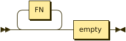

```
S        ::= FN* empty
```

**FN:**

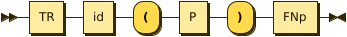

```
FN       ::= TR id '(' P ')' FNp
```

referenced by:

* S

**TR:**

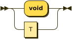

```
TR       ::= 'void'
           | T
```

referenced by:

* FN

**P:**

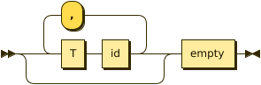

```
P        ::= ( T id ( ',' T id )* )? empty
```

referenced by:

* FN

**FNp:**

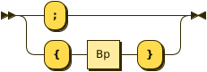

```
FNp      ::= ';'
           | '{' Bp '}'
```

referenced by:

* FN

**Bp:**

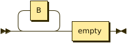

```
Bp       ::= B* empty
```

referenced by:

* CA
* DT
* ELSEP
* FNp
* I
* WH

**B:**

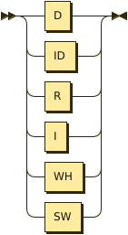

```
B        ::= D
           | ID
           | R
           | I
           | WH
           | SW
```

referenced by:

* Bp

**D:**

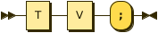

```
D        ::= T V ';'
```

referenced by:

* B

**T:**

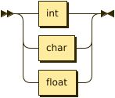

```
T        ::= int
           | char
           | float
```

referenced by:

* D
* P
* TR

**V:**

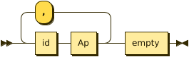

```
V        ::= id Ap ( ',' id Ap )* empty
```

referenced by:

* D

**Ap:**

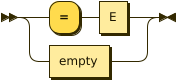

```
Ap       ::= '=' E
           | empty
```

referenced by:

* V

**ID:**

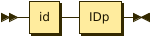

```
ID       ::= id IDp
```

referenced by:

* B

**IDp:**

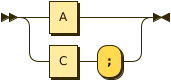

```
IDp      ::= A
           | C ';'
```

referenced by:

* ID

**A:**

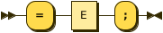

```
A        ::= '=' E ';'
```

referenced by:

* IDp

**E:**

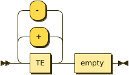

```
E        ::= TE ( ( '+' | '-' ) TE )* empty
```

referenced by:

* A
* APL
* Ap
* CA
* F
* L
* Rp
* SW

**TE:**

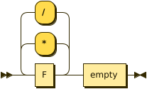

```
TE       ::= F ( ( '*' | '/' ) F )* empty
```

referenced by:

* E

**F:**

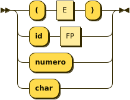

```
F        ::= '(' E ')'
           | 'id' FP
           | 'numero'
           | 'char'
```

referenced by:

* TE

**FP:**

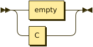

```
FP       ::= empty
           | C
```

referenced by:

* F

**C:**

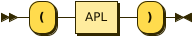

```
C        ::= '(' APL ')'
```

referenced by:

* FP
* IDp

**APL:**

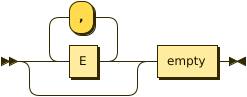

```
APL      ::= ( E ( ',' E )* )? empty
```

referenced by:

* C

**L:**

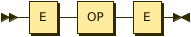

```
L        ::= E OP E
```

referenced by:

* ELSEP
* I
* WH

**OP:**

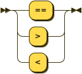

```
OP       ::= '=='
           | '>'
           | '<'
```

referenced by:

* L

**R:**

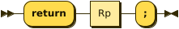

```
R        ::= 'return' Rp ';'
```

referenced by:

* B

**Rp:**

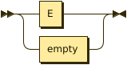

```
Rp       ::= E
           | empty
```

referenced by:

* R

**I:**

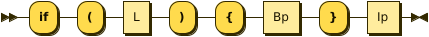

```
I        ::= 'if' '(' L ')' '{' Bp '}' Ip
```

referenced by:

* B

**Ip:**

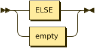

```
Ip       ::= ELSE
           | empty
```

referenced by:

* ELSEP
* I

**ELSE:**

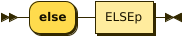

```
ELSE     ::= 'else' ELSEp
```

referenced by:

* Ip

**ELSEP:**

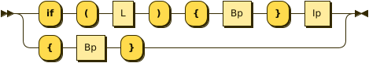

```
ELSEP    ::= 'if' '(' L ')' '{' Bp '}' Ip
           | '{' Bp '}'
```

**WH:**

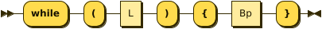

```
WH       ::= 'while' '(' L ')' '{' Bp '}'
```

referenced by:

* B

**SW:**


```
SW       ::= 'switch' '(' E ')' '{' CS '}'
```

referenced by:

* B

**CS:**

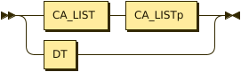

```
CS       ::= CA_LIST CA_LISTp
           | DT
```

referenced by:

* SW

**CA_LISTp:**

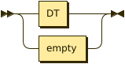

```
CA_LISTp ::= DT
           | empty
```

referenced by:

* CS

**CA_LIST:**

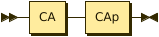

```
CA_LIST  ::= CA CAp
```

referenced by:

* CAp
* CS

**CAp:**

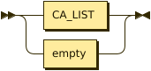

```
CAp      ::= CA_LIST
           | empty
```

referenced by:

* CA_LIST

**CA:**

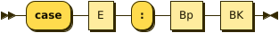

```
CA       ::= 'case' E ':' Bp BK
```

referenced by:

* CA_LIST

**DT:**

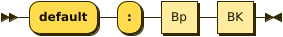

```
DT       ::= 'default' ':' Bp BK
```

referenced by:

* CA_LISTp
* CS

## 
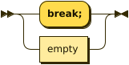